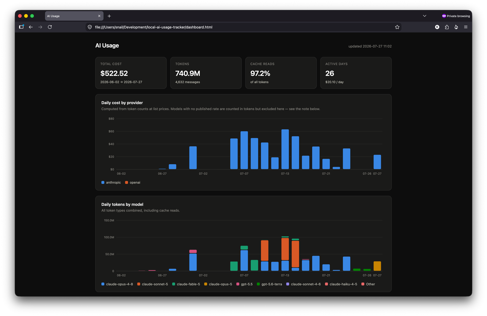

# local-ai-usage-tracker

A permanent, local history of Claude Code and ChatGPT (Codex) usage, with a
dashboard of theoretical cost. Stdlib Python + SQLite, no dependencies, no
server. Runs from launchd once or twice a day and writes a single
self-contained `dashboard.html`.

```
launchd (2x/day)
  └─ collect.py
       ├─ ~/.claude/projects/*.jsonl   ─┐   (Claude Pro)
       ├─ ~/.codex/sessions/*.jsonl    ─┤   (ChatGPT Plus)
       ├─ Anthropic Admin API          ─┼─> data/usage.db (SQLite)
       └─ OpenAI Admin API             ─┘        │
                                                 v
                                          dashboard.html
```

## Example



Real output from an actual `dashboard.html` — nothing here is staged. Every
number, chart, and note (including the "some tokens are unpriced" callout) is
generated straight from `usage_event`; there's no separate demo mode.

## Why this exists

`ccusage` reads `~/.claude/projects/*.jsonl`, and **Claude Code deletes those on
a 30-day rolling window** (`cleanupPeriodDays`). That is why a `ccusage monthly`
run in late July shows an implausibly small June — most of June was already
gone. This tool archives those files before they age out, so history accumulates
instead of scrolling off the back.

## Setup

```sh
git clone <this repo>
cd local-ai-usage-tracker
./setup.sh                # .env, shell aliases, optional launchd schedule
aiusage                   # collect + build dashboard (alias for ./collect.py)
aiusage-dashboard         # open dashboard.html
```

`setup.sh` is idempotent — re-run it anytime. It will:

- copy `.env.example` to `.env` if you don't have one (add API keys later, optional)
- add `aiusage`, `aiusage-status`, and `aiusage-dashboard` aliases to `~/.zshrc`
- offer to install the launchd agent that runs the collector twice a day

Prefer to do it by hand instead? `./collect.py` collects and builds the
dashboard; `./collect.py --status` prints what's in the database and the last
few runs.

### Schedule it

`setup.sh` handles this (see above) by rendering
`local.ai-usage-tracker.plist.template` with your actual repo path and loading
it. To do it manually instead:

```sh
sed "s#__REPO_DIR__#$(pwd)#g" local.ai-usage-tracker.plist.template \
  > ~/Library/LaunchAgents/local.ai-usage-tracker.plist
launchctl load ~/Library/LaunchAgents/local.ai-usage-tracker.plist
launchctl start local.ai-usage-tracker    # run once now to verify
tail -f data/collect.log
```

Runs at 09:00 and 21:00. `RunAtLoad` makes it catch up after the Mac was asleep
at a scheduled time — without it, a closed lid means that run is simply skipped.

### Also do this once

```jsonc
// ~/.claude/settings.json
"cleanupPeriodDays": 3650
```

Already applied. It stops Claude Code deleting the JSONL in the first place.
The archive is the belt to that suspenders: it keeps working if the setting is
ever reset by a reinstall.

## Sources

| Source | Credential | Covers | History |
|---|---|---|---|
| `claude_code_local` | none | Claude Code, incl. Pro/Max subscription | forward from first run (+ the current 30-day window) |
| `codex_local` | none | Codex CLI & Desktop, incl. ChatGPT Plus | forward from first run (+ whatever Codex still holds) |
| `anthropic_admin` | Admin key, **orgs only** | metered API usage; Claude Code analytics | backfills |
| `openai_admin` | Admin key, **orgs only** | platform API usage (**not** ChatGPT) | backfills |

### If you are on $20 individual plans

Neither vendor exposes subscription usage through an API, and neither will issue
an admin key without an organization. The local sources are the whole answer, and
they are not a consolation prize — both record per-turn token counts with the
working directory attached, which no endpoint provides.

What is **not** recoverable: usage from the chat web apps themselves
(claude.ai, chatgpt.com). Those run server-side and write nothing locally. Only
the coding agents — Claude Code and Codex — keep a local ledger.

Every source writes the same `usage_event` schema, so the dashboard and all
queries are provider-agnostic. Sources are independently skippable — a missing
OpenAI key never blocks the Claude Code archive.

### A note on the Anthropic API

Anthropic *does* have usage endpoints that mirror OpenAI's shape:

- `/v1/organizations/usage_report/messages` — tokens by model, daily buckets
- `/v1/organizations/cost_report` — billed dollars
- `/v1/organizations/usage_report/claude_code` — per-user Claude Code, and it
  reports `customer_type: "subscription"`, so it does cover Pro/Max seats

All three need an Admin API key (`sk-ant-admin01-…`), and **Anthropic does not
issue those to individual accounts** — you need an organization. If you set one
up, drop the key in `.env` and `anthropic_admin` activates with no other
changes; it lands in the same table alongside the local ingest.

Until then the local JSONL ingest is the only path to Claude Code numbers, which
is why it exists. It is not a downgrade: it is *more* granular than the API
(per-message, with `cwd` and git branch, which no endpoint exposes).

## Cost accounting

**Tokens are stored; dollars are computed at render time.** A pricing change
re-prices all history instead of freezing bad numbers into rows. Rates live in
`aiusage/pricing.py`, one list-price table per provider:

- cache write, 5-minute TTL → 1.25× input rate
- cache write, 1-hour TTL → 2.00× input rate
- cache read → 0.10× input rate

A model with no rate on file is counted in tokens and **excluded from cost**,
never silently priced at zero; the dashboard says so.

`openai_admin`'s Costs endpoint is the one exception: it reports real billed
dollars for admin-key holders, so those go into `provider_cost` verbatim
instead of being re-derived from the rate table.

> **These dollars are notional if you are on a subscription.** They are token
> counts × list API prices — the right measure of *what you consumed*, but not
> an invoice. ChatGPT Plus and Claude Pro/Max don't bill per token at all.
> Don't reconcile these numbers against a card statement.

## Verification

Both local sources reconcile exactly against an independent scan of their own
raw files, and Claude Code additionally reconciles with `ccusage monthly`:

| | input | output | cache write | cache read | total | cost |
|---|---|---|---|---|---|---|
| ccusage | 19,938 | 86,084 | 415,146 | 7,860,779 | 8,381,947 | $10.33 |
| this | 19,938 | 86,084 | 415,146 | 7,860,779 | 8,381,947 | $10.33 |

Codex: 614 turns / 40,600,510 tokens in the database against 40,600,510 counted
by a direct scan of `~/.codex/sessions`.

## Design notes

**Idempotency.** Every row carries a deterministic primary key — message id +
request id for Claude Code, bucket + model + project for the APIs — and writes
are `INSERT OR REPLACE`. Running the collector twice in a row changes nothing,
and API buckets that get restated a day later self-correct.

**Codex token math.** `info.total_token_usage` is cumulative per session while
`info.last_token_usage` is the per-turn delta; the deltas sum exactly to the
cumulative figure, so the deltas are what get stored (they carry a date).
`token_count` events name no model, so the model is carried forward from the
preceding `turn_context`. A few compaction turns report a total with the whole
breakdown zeroed — those are attributed to input rather than dropped, which is
what makes the two totals match to the token.

**Incremental reads.** Each archived JSONL records a byte offset, so a run only
parses what was appended since last time. A partial trailing line (a session
still being written) is left unread until it is complete. Full first run:
~8,300 messages in 0.3s.

**`coarse_daily_tokens`.** Claude Code's own `stats-cache.json` keeps a per-day,
per-model token count that outlives the JSONL window — but it is one scalar with
no input/output/cache split, so it cannot be priced. It is stored in a separate
table and shown as a footnote, never mixed into cost totals.

## Layout

```
collect.py                              entry point
setup.sh                                one-time setup: .env, shell aliases, launchd
local.ai-usage-tracker.plist.template   launchd agent template (setup.sh fills in the path)
aiusage/
  db.py                                 schema, upserts, run log
  pricing.py                            rate table, cost computation
  http.py                               stdlib GET with retry/backoff
  dashboard.py                          SQL -> JSON -> static HTML
  sources/
    claude_code_local.py                archive + incremental JSONL parse
    codex_local.py                      same, for Codex rollout files
    anthropic_admin.py                  Usage & Cost Admin API
    openai_admin.py                     Usage & Costs API
data/
  usage.db                              SQLite
  archive/                              mirrored Claude Code JSONL, the durable copy
  archive-codex/                        mirrored Codex rollout files
dashboard.html                          regenerated each run
```

## Privacy

Everything this tool produces is local and personal: `data/` (the SQLite DB
and the archived JSONL transcripts) and `dashboard.html` (which embeds your
project names, token counts, and dollar figures inline). Both are gitignored.
If you fork or clone this repo, nothing you generate by running the collector
gets committed — only the code does. Don't remove those `.gitignore` entries
without knowing what you're exposing.

## Adding Ollama later

The schema already has a `provider` column and `is_free()` handles zero-cost
models. Ollama keeps no token accounting of its own — its logs record no
inference requests at all — so it needs a small reverse proxy on 11435 that
forwards to 11434 and records `prompt_eval_count` / `eval_count` from each
response. That captures every client rather than one tool's storage format.
Drop it in as `sources/ollama_proxy.py`; nothing else changes.
